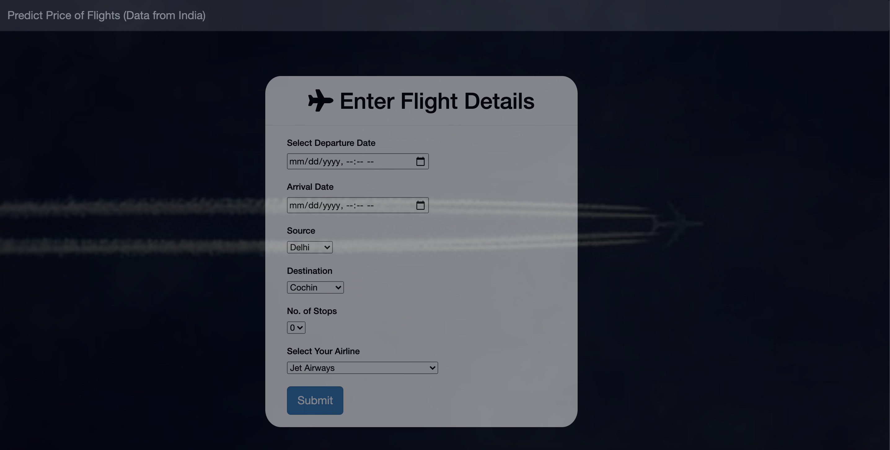
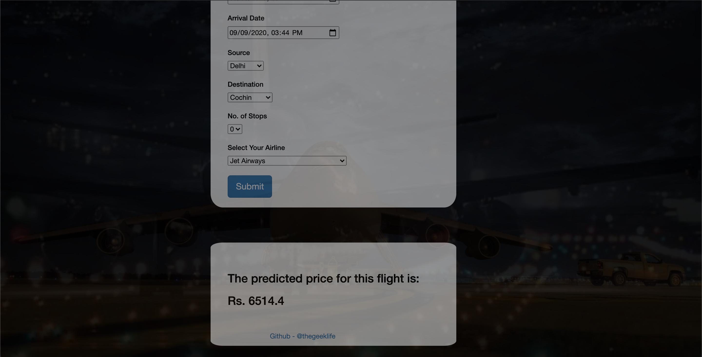

# Predicting-Price-of-Flight

End-end python based application for predicting the prices of flights. 

# Web Application Page

A small application built using flask.

* Home

* Predicted Price

# ML Model
Predicts the price of flights based on several features:
* Duration of the flight 
* Number of stops
* Arrival and Location Destination
* Journey Dates
* Time of Arrival and Departure
* Airline Chosen

Random Forest Regressor was used for prediction and performance was measured using R^2 and RMSE.
